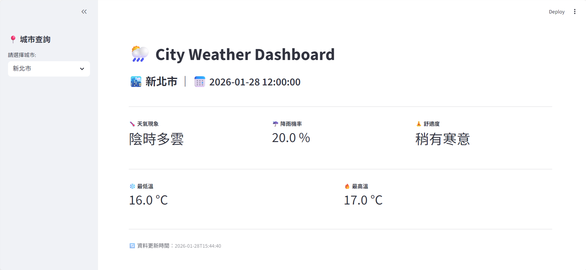

# weather-data-pipeline

### Overview
This project implements an automated ETL (Extract, Transform, Load) pipeline for weather data, designed to collect, process, and store meteorological information for downstream analysis and visualization.

### Pipeline Workflow
1.  **Data Extraction**: Automated cron jobs retrieve real-time weather metrics from the Central Weather Administration (CWA) API every 6 hours.
2.  **Data Transformation**: Clean JSON responses, handle missing values, and standardize data formats using Python processing libraries.
3.  **Data Loading**: Store structured data into a MySQL relational database for persistence.
4.  **Data Usage**: A REST API built with FastAPI serves as the interface between the database and downstream applications.
5.  **Data Presentation**: A Streamlit web application provides an intuitive dashboard for displaying weather forecasts.

### Getting Started
1. **Configure environment variables**: Copy the template and update the settings (e.g., API keys, database credentials) as needed.
    ```bash
    cd weather-data-pipeline
    cp .env.example .env
    vi .env
    ```
2. **Launch services**: Use Docker Compose to start the entire infrastructure.
    ```bash
    docker compose up -d
    ```
3. **Access the application**: After all containers are up and running, then open your browser and navigate to `http://localhost:8501` to view the dashboard.

### Additional Resources
- **Deployment**: Includes `Dockerfile`, `docker-compose.yml`, and `requirements.txt` for containerized deployment.
- **Development**: An `environment.yml` file is provided for setting up a local Conda development environment.

---

### 專案簡介
本專案實現了自動化的天氣數據 ETL (擷取、轉換、載入) 流程，旨在收集、處理並儲存氣象資訊，以供後續分析與視覺化使用。

### 工作流程
1.  **數據擷取 (Extraction)**：建立排程任務 (Cron Job)，每 6 小時從中央氣象署 (CWA) API 獲取即時天氣指標。
2.  **數據轉換 (Transformation)**：清理 JSON 回應、處理缺失值，並使用資料處理套件將數據格式標準化。
3.  **數據載入 (Loading)**：將結構化數據持久化至 MySQL 關聯式資料庫。
4.  **數據使用 (Usage)**：利用 FastAPI 建立 REST API 作為資料庫介面，供下游應用程式調用。
5.  **數據呈現 (Presentation)**：開發 Streamlit Web App，提供直觀的天氣預報展示介面。

### 如何開始
1. **設定環境變數**：請在專案根目錄下執行以下指令，並根據需求設定資料庫密碼與 CWA API 金鑰。
    ```bash
    cd weather-data-pipeline
    cp .env.example .env
    vi .env
    ```
2. **啟動服務**：執行以下指令以容器化方式啟動所有服務。
    ```bash
    docker compose up -d
    ```
3. **存取 Web App**：待所有 container 都啟動後，開啟瀏覽器並前往 `http://localhost:8501` 即可存取儀表板。

### 其他資源
- **快速部署**：專案包含 `Dockerfile`、`docker-compose.yml` 及 `requirements.txt`，支援快速佈署與擴充。
- **開發環境**：提供 `environment.yml` 設定檔，方便開發者建立一致的 Conda 虛擬環境。

---

